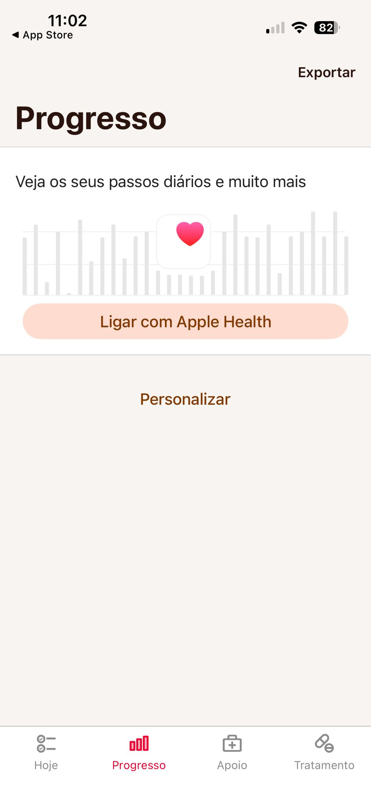
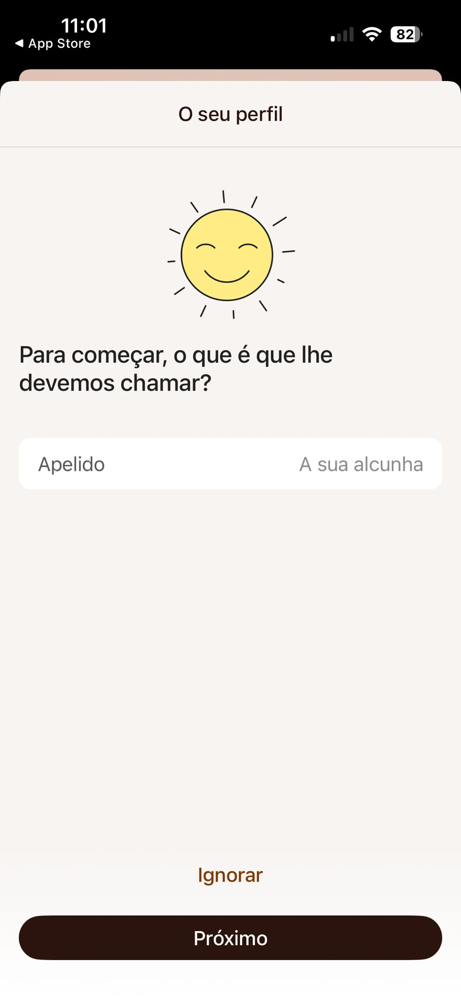
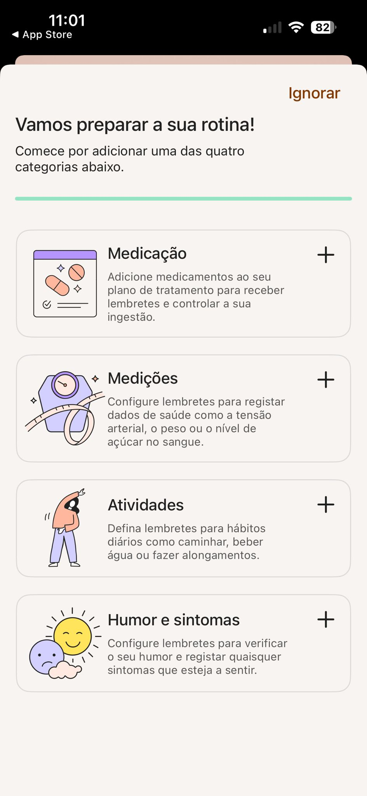
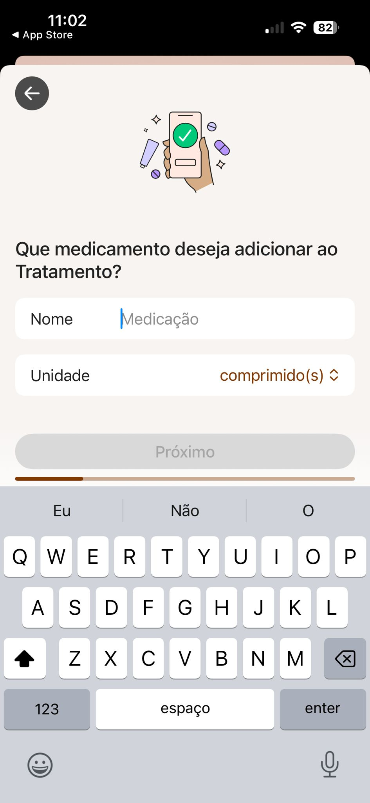
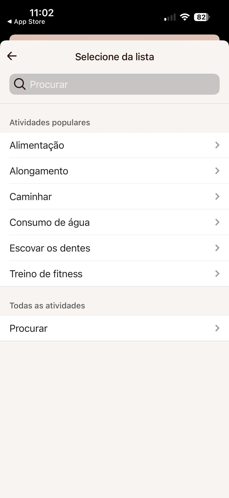
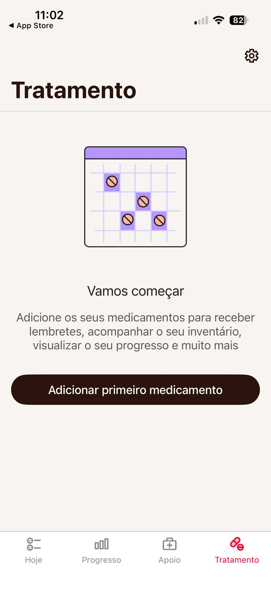
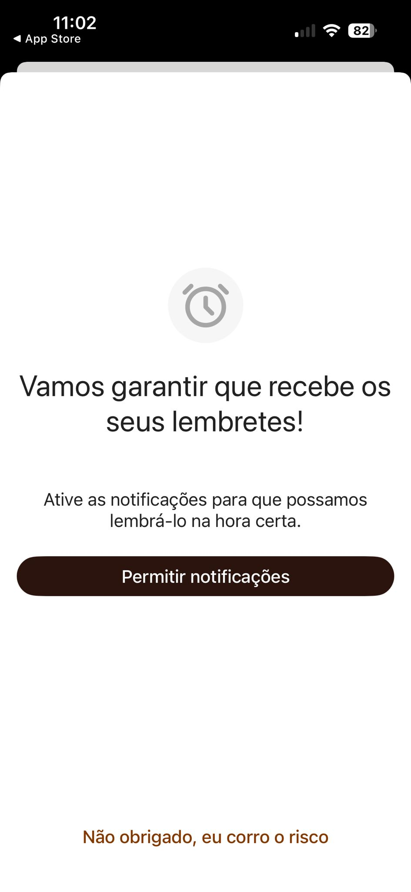
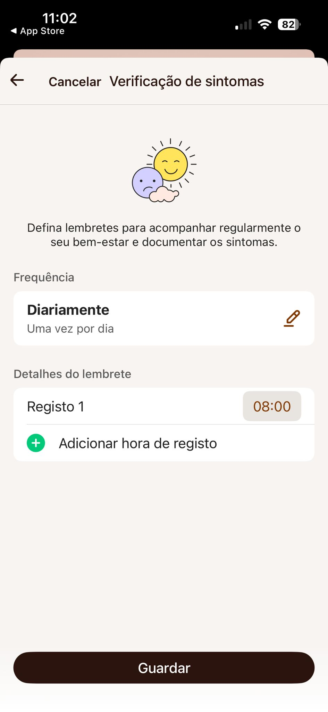
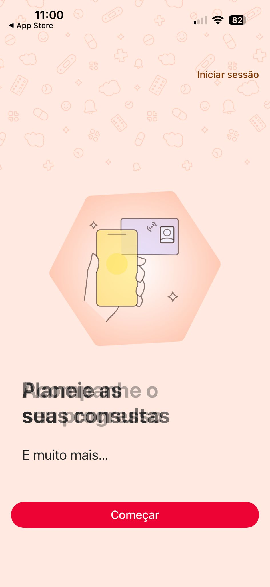

# Análise - MyTherapy
**Responsável:** Francisco Soudo (14060)

## Descrição Geral
O MyTherapy é uma aplicação móvel focada na gestão abrangente da medicação e manutenção da saúde do utilizador, estando disponível nas plataformas Android e iOS. A aplicação vai além dos simples lembretes de medicação ao permitir registar sintomas diários, aferir parâmetros essenciais de saúde (como a pressão arterial, ritmo cardíaco, glicemia e peso) e construir um histórico pessoal. Uma das suas valências mais fortes é a capacidade de compilar estes dados em relatórios práticos para partilhar com profissionais de saúde. Adicionalmente, possui uma forte componente social ao permitir a inclusão de familiares ou profissionais de saúde no acompanhamento do doente.

## Interface e Design
A interface do MyTherapy apoia-se num design "limpo" (clean), predominantemente com fundo branco e acentos em azul claro, transmitindo uma sensação de ambiente clínico, organizado e seguro. 
O ecrã principal funciona como uma *To-Do List* (agenda diária), mostrando os medicamentos e as atividades de saúde ordenadas cronologicamente. Beneficia de uma navegação simples baseada numa barra inferior (Bottom Navigation Bar) com ícones intuitivos. A tipografia de grandes dimensões, os botões largos e os espaçamentos (white space) abundantes evidenciam um cuidado especial com a acessibilidade, adequando-se particularmente ao público mais idoso ou a utilizadores com dificuldades de visão ou motoras.

## Funcionalidades Principais
- **Lembretes de medicação avançados**: permitem configuração de dosagens, frequência específica e confirmação de toma segura.
- **Inventário de medicamentos**: controlo das embalagens que alerta o utilizador quando os medicamentos estão perto de acabar.
- **Registo holístico de saúde**: possibilidade de registar humor, sintomas variados e bem-estar geral diariamente.
- **Monitorização paramétrica**: medição e gravação de parâmetros de saúde como tensão arterial, peso, ritmos de sono e níveis de glicemia.
- **Diário de progresso**: visualização contínua do perfil de saúde através de gráficos fáceis de interpretar e visualizar.
- **Geração e exportação de relatórios**: criação de documentos em PDF completos com histórico, ideais para análise em consultas médicas.
- **Modo familiar/equipa (Team)**: permite a familiares e/ou cuidadores acompanharem se as tomas estão a ser feitas adequadamente e emitirem o seu próprio apoio motivacional.

## Pontos Positivos da Interface
1. **Design acessível e minimizador do esforço cognitivo**: a interface é direta, com poucos estímulos visuais concorrentes por ecrã, o que reduz substancialmente a curva de aprendizagem, crucial para os utilizadores seniores.
2. **Confirmação de toma à prova de erro**: o utilizador tem de realizar uma ação concreta de "aceitar" (por exemplo, um deslize ou clique intencional em botão largo), o que diminui a probabilidade de confirmações de toma acidentais.
3. **Agenda visual e cronológica**: apresentar os dados na forma de tarefas do dia organizadas pela hora torna claro o que permanece pendente.
4. **Sistema de "Gamificação"**: recompensas visuais e estatísticas de adesão à toma que incentivam à continuidade da medicação.

## Pontos Negativos / Limitações da Interface
1. **Risco de sobrecarga funcional**: ao juntar a medicação, humor, atividades físicas e medições laboratoriais num todo, a aplicação pode intimidar os novos utilizadores que apenas procuram um alarme básico para a pílula/medicamento.
2. **Processo de inserção extenso**: introduzir um novo medicamento obriga o utilizador a percorrer demasiados passos (escolha do medicamento, dosagem, horas e alarmes associados, etc.), aborrecendo e sendo uma barreira para quem tem pouca experiência digital.
3. **Escassez de distinção nas notificações**: os alertas no ecrã bloqueado para "toma de comprimido" ou "registo de sintomas" podem não ser visualmente distintos o suficiente, podendo o utilizador descurar ambos.
4. **Navegação nas configurações**: opções de perfil ou configurações avançadas exigem alguma procura pelos vários submenus.

## Capturas de Ecrã da Aplicação (MyTherapy)

Aqui encontram-se vários ecrãs que atestam a navegação e a experiência de utilizador na aplicação:

