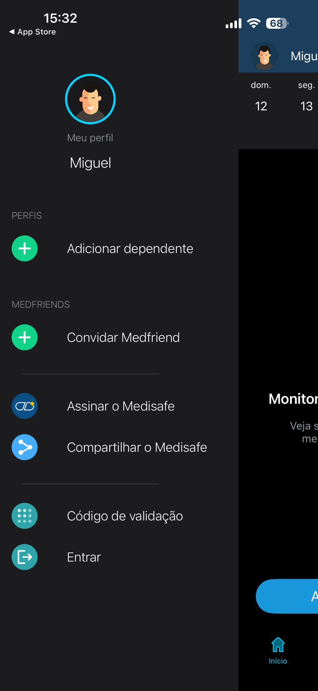
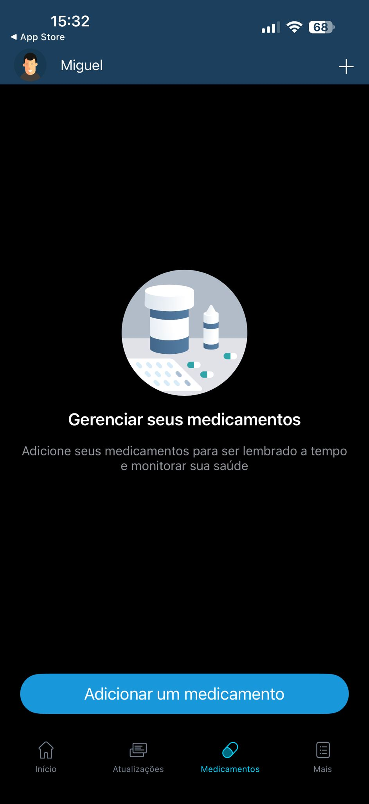
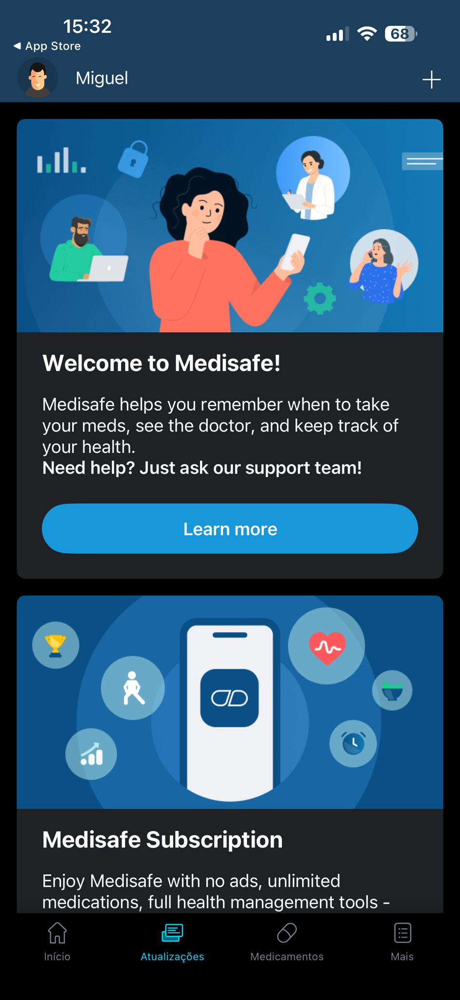
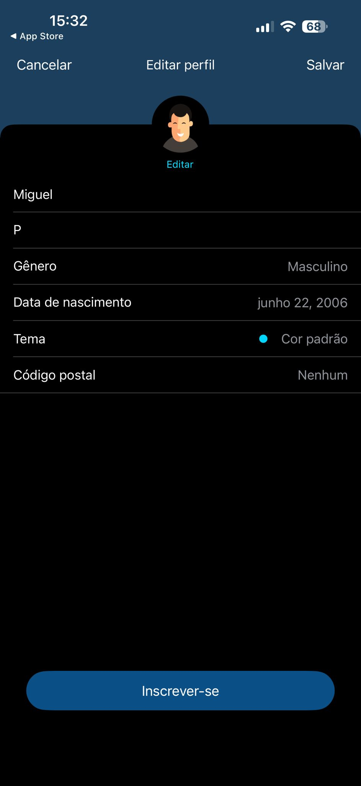
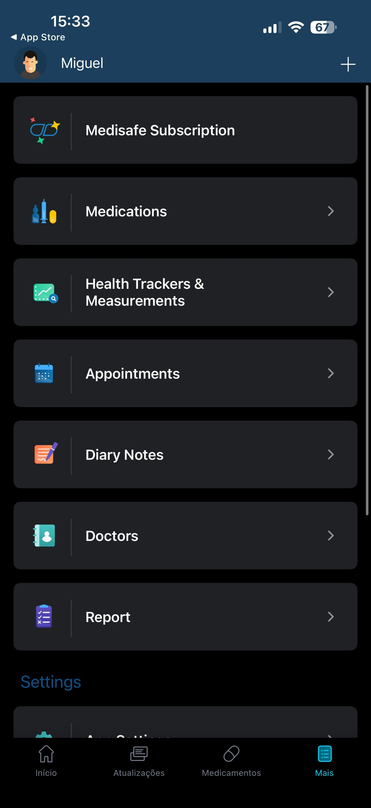
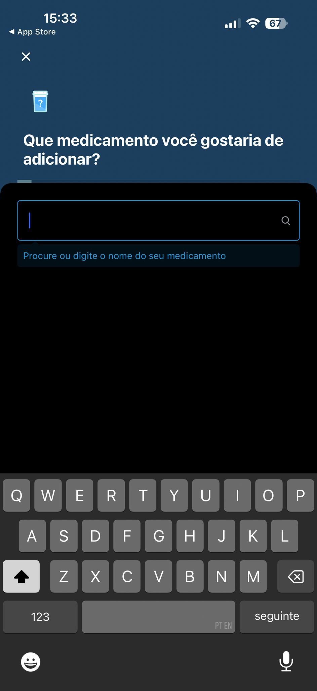
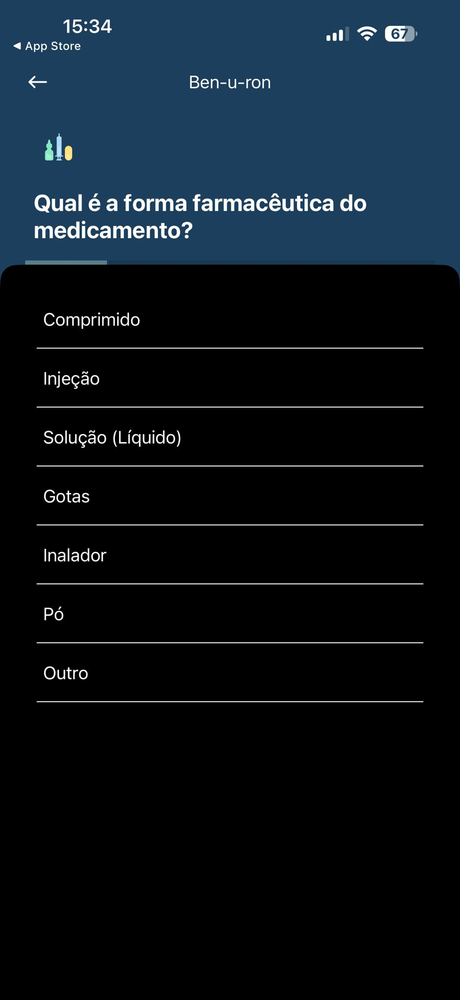
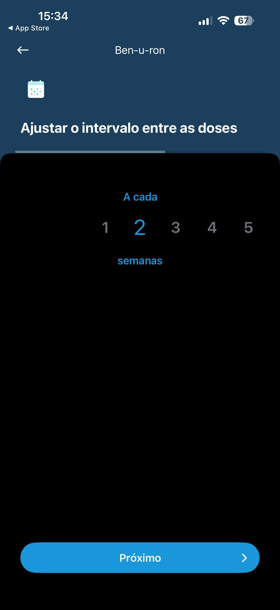
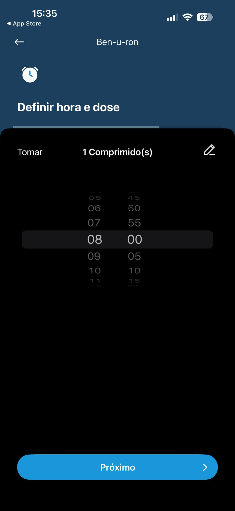

# Análise - Medisafe
**Responsável:** Miguel Pauzinho (27131)

## Descrição Geral
O Medisafe é uma aplicação móvel de gestão de medicação disponível para Android e iOS. Permite ao utilizador registar os seus medicamentos, definir horários de toma e receber alertas. Tem também funcionalidades sociais, como notificar um familiar quando uma toma é ignorada.

## Interface e Design
A interface do Medisafe utiliza um esquema de cores suaves (branco, azul e verde) que transmite uma sensação de saúde e confiança. O ecrã principal apresenta um resumo visual do dia com os medicamentos a tomar em cada hora, organizado de forma cronológica. A tipografia é legível e os botões são grandes, pensados para utilizadores com menos destreza manual.

## Funcionalidades Principais
- Registo de medicamentos com nome, dosagem e horário
- Alertas e notificações de toma
- Confirmação de toma com um toque
- Histórico de tomas (aderência)
- Notificação a um familiar/cuidador em caso de toma ignorada
- Relatório de medicação exportável para o médico

## Pontos Positivos da Interface
1. **Visibilidade do estado do sistema** - o ecrã principal mostra claramente quais os medicamentos tomados, pendentes e ignorados através de cores distintas (verde = tomado, vermelho = ignorado)
2. **Simplicidade e foco** - a ação principal (confirmar toma) é feita com um único toque, sem passos intermédios desnecessários
3. **Ícones visuais por medicamento** - cada medicamento tem uma representação visual (comprimido, cápsula, injeção) que facilita o reconhecimento, especialmente para utilizadores com dificuldades de leitura
4. **Alertas personalizáveis** - o utilizador pode definir sons, vibração e mensagens personalizadas para cada medicamento

## Pontos Negativos / Limitações da Interface
1. **Registo inicial complexo** - adicionar um novo medicamento exige preencher muitos campos (nome, dosagem, frequência, horário, unidade), o que pode ser confuso para utilizadores menos experientes em tecnologia
2. **Excesso de funcionalidades na versão gratuita** - a interface apresenta várias opções premium bloqueadas que criam confusão visual e distraem o utilizador das funções essenciais
3. **Navegação pouco intuitiva** - as secções de histórico e relatórios estão escondidas em menus secundários, dificultando o acesso rápido para quem não conhece bem a app

## Capturas de Ecrã da Aplicação (Medisafe)

Aqui encontram-se vários ecrãs que atestam a navegação e a experiência de utilizador na aplicação:

