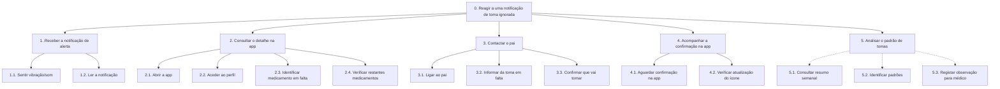

# Análise de Tarefas HTA - Cenário 2
**Responsável:** Francisco Soudo (14060)
**Persona:** Carla Sousa
**Tarefa principal:** Receber e reagir a uma notificação de toma ignorada pelo pai

## Decomposição Hierárquica

```
0. Reagir a uma notificação de toma ignorada
  1. Receber a notificação de alerta
    1.1. Sentir a vibração/ouvir o som do telemóvel
    1.2. Ler a notificação (nome do medicamento e tempo de atraso)
  2. Consultar o detalhe na app
    2.1. Abrir a app EasyMed
    2.2. Aceder ao perfil do pai
    2.3. Identificar o medicamento em falta (ícone vermelho)
    2.4. Verificar o estado dos restantes medicamentos do dia
  3. Contactar o pai
    3.1. Ligar ao pai pelo telemóvel
    3.2. Informar o pai da toma em falta
    3.3. Confirmar que o pai vai tomar o medicamento
  4. Acompanhar a confirmação na app
    4.1. Aguardar a confirmação do pai na app
    4.2. Verificar que o ícone muda para amarelo (toma com atraso)
  5. Analisar o padrão de tomas (opcional)
    5.1. Consultar o resumo semanal do pai
    5.2. Identificar padrões de tomas ignoradas
    5.3. Registar observação para mencionar ao médico
```

## Diagrama


