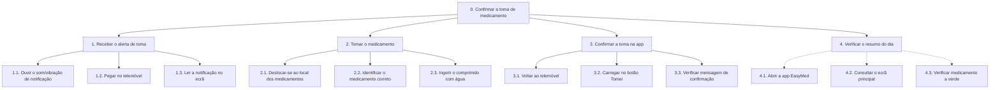

# Análise de Tarefas HTA - Cenário 1
**Responsável:** Miguel Pauzinho (27131)
**Persona:** António Ferreira
**Tarefa principal:** Confirmar a toma de medicamento através da app EasyMed

## Decomposição Hierárquica

```
0. Confirmar a toma de medicamento
  1. Receber o alerta de toma
    1.1. Ouvir o som/vibração de notificação
    1.2. Pegar no telemóvel
    1.3. Ler a notificação no ecrã (nome do medicamento e hora)
  2. Tomar o medicamento
    2.1. Deslocar-se ao local onde guarda os medicamentos
    2.2. Identificar o medicamento correto pelo nome
    2.3. Ingerir o comprimido com água
  3. Confirmar a toma na app
    3.1. Voltar ao telemóvel
    3.2. Carregar no botão "Tomei" na notificação
    3.3. Verificar a mensagem de confirmação no ecrã
  4. Verificar o resumo do dia (opcional)
    4.1. Abrir a app EasyMed
    4.2. Consultar o ecrã principal com o estado das tomas do dia
    4.3. Verificar que o medicamento está marcado a verde
```

## Diagrama


