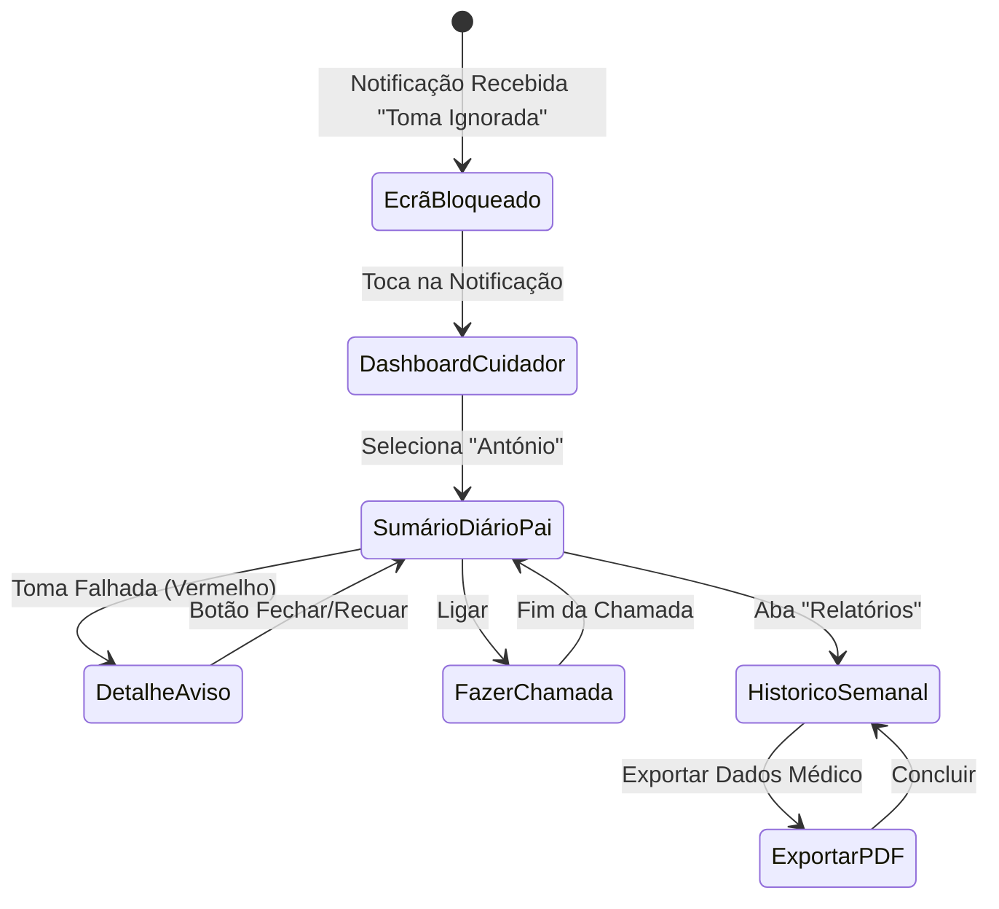

# Diagramas de Navegação - Francisco Soudo (14060)

O diagrama abaixo elucida a estrutura macro e as lógicas de fluxo das vistas associadas ao **Cenário 2** - um cuidador (Carla) a reagir ativamente a uma notificação de omissão de medicação do pai dependente.

## Navegação (Mermaid)

### Explicação da Arquitetura de Navegação

O sistema de navegação baseia-se num fluxo simples de reatividade, despoletado ou desencadeado a partir do Ecrã de Bloqueio por via de uma notificação Push que encurta o tempo do Cuidador na obtenção da informação chave. A navegação interna é concêntrica no separador *Sumário Diário*, evitando bifurcações de ecrãs não termináveis para o lado e evitando o esquecimento do contexto da "tarefa urgência". Daí, um simples botão permite transitar da verificação visual para atuar sobre o evento "Fazer Chamada".
