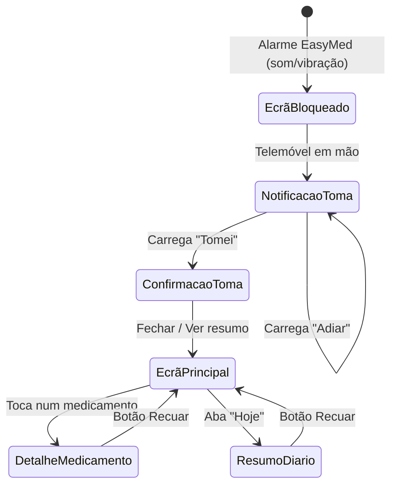

# Diagramas de Navegação - Miguel Pauzinho (27131)

O diagrama abaixo ilustra a estrutura de navegação associada ao **Cenário 1** - o paciente (António) a receber um alerta e a confirmar a toma do medicamento.

## Navegação (Mermaid)

### Explicação da Navegação

O fluxo do Cenário 1 é intencionalmente simples e linear, pensado para o perfil do António (idoso, baixa literacia digital). O ponto de entrada é a **notificação no ecrã bloqueado**, evitando que o utilizador tenha de abrir a app manualmente. A partir daí, a ação principal — carregar em "Tomei" — está a um único toque de distância. O ecrã de confirmação dá feedback imediato (visto verde + hora registada) antes de regressar ao ecrã principal. A consulta do resumo diário é opcional e só ocorre se o António decidir abrir a app por iniciativa própria.
