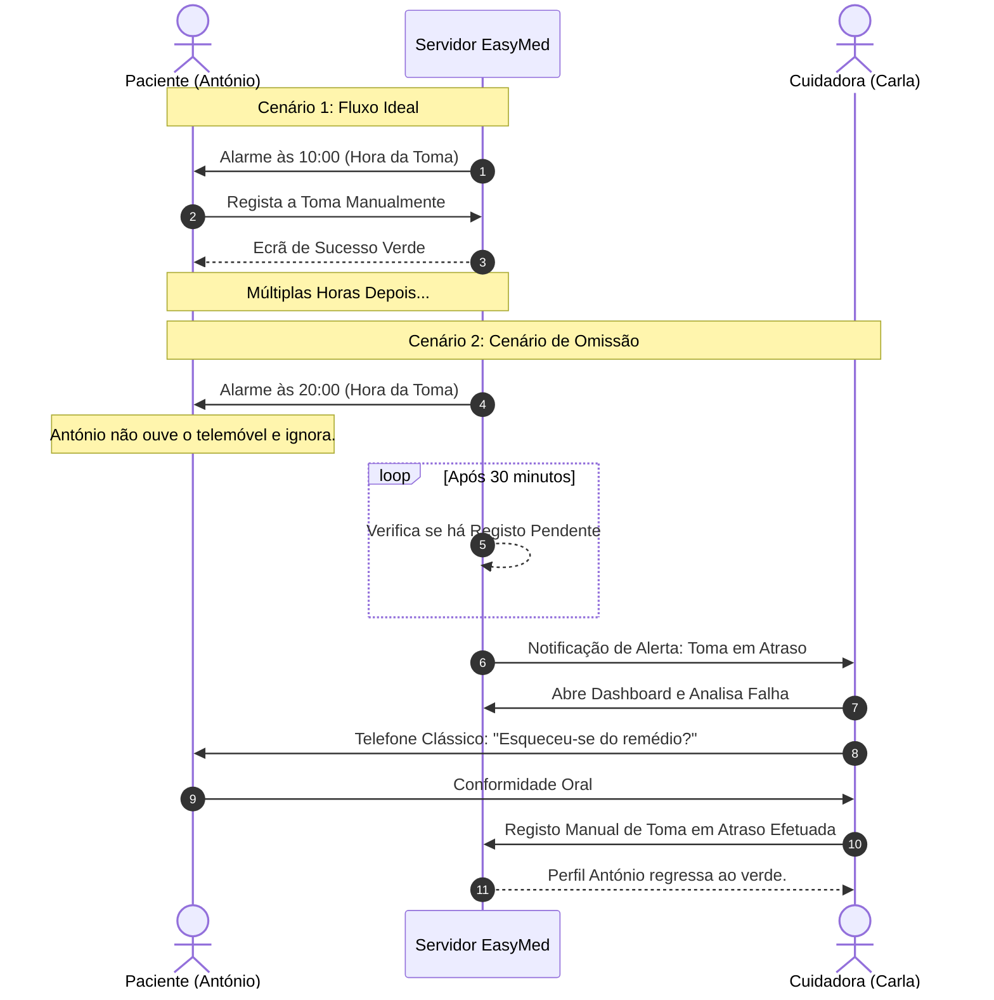

# Storyboard: Aplicação EasyMed

O *storyboard* abaixo apresenta, em formato de diagrama e fluxo narrativo, os dois cenários principais definidos pela equipa para a aplicação **EasyMed**.

---

## 🧍 Cenário 1: O Paciente confirma a Toma (Miguel)
**Objetivo:** Receber o alerta e validar que tomou o medicamento com sucesso.

### Flow Visual em "Pictogramas Textuais"
`[ 📱 Alarme ] ➔ [ 💊 Ver Remédio ] ➔ [ 🥤 Tomar ] ➔ [ ✅ Confirmar na App ] ➔ [ 🏆 Sucesso ]`

### Descrição dos Painéis
| Quadro | Imagem Mental (Emoji) | O que acontece (Ação) | O que a TV/Ecrã mostra |
| :---: | :---: | :--- | :--- |
| **1** | 📳⏰ | O telemóvel do Senhor António começa a vibrar no bolso. | Notificação Push com texto grande: **"Hora do Medicamento - 10:00"**. |
| **2** | 📱👀 | António tira os óculos para perto e olha para o telemóvel. | Ecrã bloqueado com um aviso destacado em caixa de texto branca. |
| **3** | 👆💊 | António carrega na notificação; a aplicação "EasyMed" abre. | Ecrã mostra uma foto grande da caixa do comprimido (*Ex: Ben-U-Ron*), a dosagem (1 comp.) e um botão verde gigante gigante "Já Tomei". |
| **4** | 🥤😌 | António bebe água, engole o remédio. | O mesmo ecrã aguarda a ação do utilizador. |
| **5** | 🟢👍 | António carrega no botão verde. A app emite um som agradável de confirmação. | Ecrã de sucesso com um "Visto" grande. O estado regressa ao ecrã principal que diz: *"Próxima toma às 20:00"*. |

---

## 👩‍⚕️ Cenário 2: A Cuidadora Lida com uma Omissão (Francisco)
**Objetivo:** Intervir preventivamente quando um paciente esquece ou ignora a toma da medicação.

### Flow Visual em "Pictogramas Textuais"
`[ 🕒 Atraso > 30m ] ➔ [ ⚠️ Alerta Cuidador ] ➔ [ 📱 Abrir Dashboard ] ➔ [ 📞 Telefonar ao Paciente ] ➔ [ 📋 Confirmar Manualmente ]`

### Descrição dos Painéis
| Quadro | Imagem Mental (Emoji) | O que acontece (Ação) | O que o Ecrã mostra |
| :---: | :---: | :--- | :--- |
| **1** | 🕒⏳ | Passam 30 minutos desde as 10:00 e o António não confirmou na sua aplicação. | O sistema deteta o prazo expirado no servidor. |
| **2** | 🚨🔔 | O telemóvel de Carla (Enfermeira/Cuidadora) vibra. | Notificação Crítica: **"Atenção: António não confirmou toma (Medicação X - 10:00)"**. |
| **3** | 🧑‍💻📊 | Carla interrompe o seu trabalho e abre a EasyMed para investigar. | "Dashboard do Cuidador". Perfil de António está a vermelho/laranja. Detalhe: "Em atraso". |
| **4** | 📞👴 | Carla clica num atalho rápido no perfil do paciente para ligar o telemóvel ao António. | *App em segundo plano.* Ecrã normal de chamada do telefone. |
| **5** | 📝✅ | António explica que se esqueceu. Carla diz-lhe para tomar. Carla marca a toma na App pela sua conta. | Botão "Forçar Registo (Vigilância)". Confirma a ação e o perfil volta a "Verde/Estável". |

---

## 🔄 Fluxo Lógico Integrado (Diagrama Gráfico)

